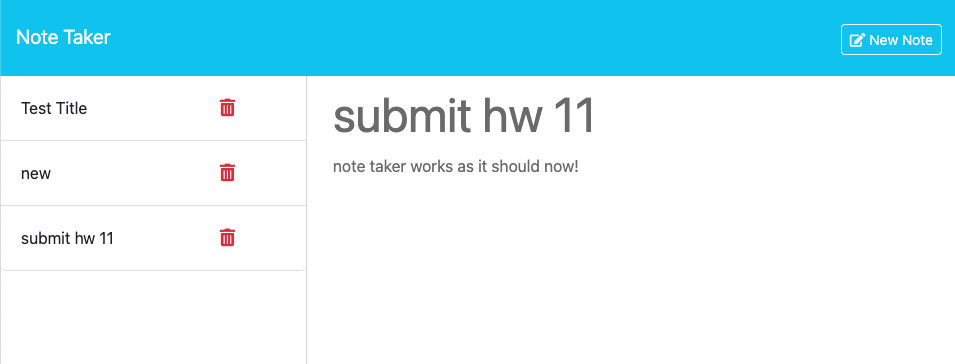

# EXPRESS NOTE TAKER

## DESCRIPTION

This note taker was created to be able to write and save notes. This app will help any user keep their ideas and thoughts organized. This app can also be used to keep track of tasks that need to be completed by giving it a title and description. Once it is done, simply click the red trash button next to the task and move on to the next one! This app can be used either way, as needed by the user. It is simply and easy to use.

My challenge with this project was getting the back end data to work with the front end. Working with the tutor, we were able to find why the list of notes was not being pulled and displaying on the app. I have definite learned how express is used to connect back end and front end to projects such as this one. 

## INSTALLATION

Simply click on the deployed link below and start using!

## USAGE

## CREDITS

I used class work as a reference and guide to work through this project and I re-watched class videos. I also had help from a tutor for final touches. I used google to read and watch videos about how express.js works and better understand how to apply to this project.

## HOW TO CONTRIBUTE

Email Me: karinagonzalezal@gmail.com
